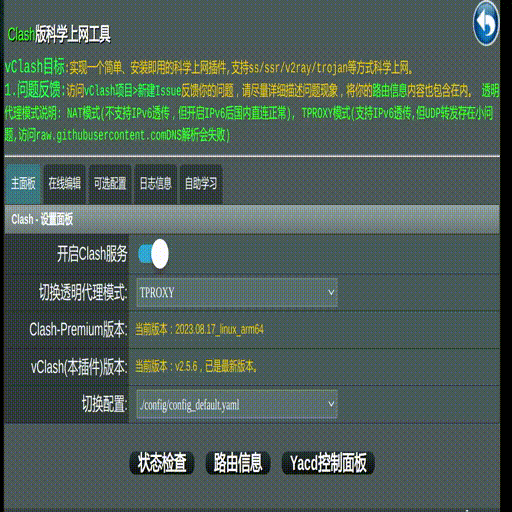

<h1 align="center">
  
   vClash科学上网插件 
</h1>

# vClash项目说明
>这个项目插件适用于`Koolshare的华硕官改、梅林改版 380/384/386固件`。会不会有openwrt版本呢？~~有时间再考虑吧~~，最近有空就编写了一个**Openwrt**版本，不过是运行在X86_64架构上并且是支持Koolshare的固件才能运行，有想尝试的可以访问这个项目[Koolshare-Clash-openwrt-amd64](https://github.com/learnhard-cn/Koolshare-Clash-openwrt-amd64)，内置了启动配置文件(安装即用!)

| Github分支    | 支持Koolshare路由器固件版本 | Github下载链接                                                                                                                                                                        | 国内CDN下载链接                                                                                             |
| ----------- | ------------------ | --------------------------------------------------------------------------------------------------------------------------------------------------------------------------------- | ----------------------------------------------------------------------------------------------------- |
| main        | 华硕380版本(停止更新)            | [斐迅K3梅林380版本](https://github.com/learnhard-cn/vClash/raw/main/release/clash.tar.gz)                     | [斐迅K3梅林380版本](https://cdn.jsdelivr.net/gh/learnhard-cn/vClash@main/release/clash.tar.gz)              |
| ksmerlin386 | 华硕官改、梅林386版本(持续更新)       | [梅林386版本](https://github.com/learnhard-cn/vClash/raw/ksmerlin386/release/clash.tar.gz) | [梅林386版本](https://cdn.jsdelivr.net/gh/learnhard-cn/vClash@ksmerlin386/release/clash.tar.gz) |

## 关于安装检测过程

安装过程需要对路由器的一些基础环境检测, 主要是判断是否能使用此插件,我总结了主要的检测如下:

1. **koolshare**软件中心版本检测: 在[github项目中](https://github.com/koolshare/rogsoft/blob/master/README.md)有介绍, 主要的区别就是 **软件中心API**分 **1.0代(在华硕380版本固件使用)** 和 **1.5代(华硕384/386版本固件使用)**, 二者代码不兼容通用, 最开始开发的main分支就是 **1.0代的华硕380版本固件使用的**, 之后新的路由器都过渡到了 **1.5代的华硕386版本固件**.
2. CPU架构检测: 根据一些分析,主要的架构型号有: armv7l/aarch64/x86_64/mips , 其中华硕固件并不支持x86_64/mips两种架构的CPU, 因此目前也只支持了 armv7l 和 aarch64(armv8).
3. Linux内核版本检测(可选): 如果编译的可执行程序非静态链接生成(依赖一些动态库),可能需要做这个检测,对于没有动态库依赖的可执行程序就没必要检测了,比如**GoLang语言编写的工具**.
4. 固件版本检测(可选): 比如华硕的目前的三个版本号(380/384/386),以后可能有更高版本, 如果对固件自带特殊命令没什么依赖就没什么必要检测.

如果安装失败了,就将安装过程日志反馈给开发者,了解上面几个检测情况,哪个环节不支持,以便于支持更多的固件。你虽然没有写代码，但这样做也是帮助这个插件更加稳定。

## 功能特点介绍

- <b style="color:red">安装即用</b>，只需要更新内部提供的`代理节点订阅源`即可使用(即不需要自己搭建梯子就能用)。
- Clash启动配置文件规划好了两级、三级中继代理组，<b style="color:red">免费解锁奈</b>飞变得更加容易了。
- 内置Cloudflare的DDNS功能，支持<b style="color:red">同时更新多个域名</b>。

## 使用前说明
> 由于GoLang版本Clash启动时分配内存空间较大，对于小内存(512MB及以下)路由器会出现**启动失败问题**,以`RT-AC86U`为例，启动时分配虚拟内存(VIRT)有600-700MB左右(实际内存使用在30-80MB左右)，对于512MB物理内存路由器直接起不来。

启动失败问题**解决方法**：

1. 挂载虚拟内存: 支持**USB接口路由器**可以插入一个1GB以上的优盘作为虚拟内存挂载，可以使用路由器自带了虚拟内存插件。[阅读挂载虚拟内存教程文章](https://vlike.work/VPS/router-mount-swap.html)。

## 为什么有这个项目

作为程序员的俺，用了很多年别人写的插件，一天翻出了垃圾堆里**零元购计划**的斐迅K3路由器，打算**变斐为宝**，毕竟曾经被他欺骗过感情的。。。

一开机，发现装了`梅林380版固件`，那就从这里开始吧。

**如何写个小巧的插件呢？** 第一个想法就是 **拿来主义**，毕竟没有 **Ctrl+C/Ctrl+V**解决不了的(玩笑话)。

找了几个插件(比如fancyss、merlinclash等)，都过于庞大,此时恰好看到**clash**挺火的，那就使用**clash**作为核心功能吧。

至此, 这个项目就诞生了。但当时名字为clash，这与clash重名可不行呀，俺想到了《V字仇杀队》电影的V,那就起名为**vClash**啦。

V带着面具，但Clash图标加面具就啥也看不到了，于是想到了另一个角色Z(佐罗)，于是在vClash上加了Z的蒙眼带。

之后，新路由器使用了`梅林改版386固件`, 于是又开发了支持`386版本`的**ksmerlin386分支**版本。

## 提供帮助

开发过程的实测路由器型号不多，一些小问题还在不断完善，如果希望本项目可以使用到自己的路由器上，有两个方法：

1. 提交issue:详细描述或截图出现的问题提交个issue，不要吝惜文字，描述的越详细越容易得到帮助(聊聊几个字俺也很无可奈何)。
2. Fork本项目:自己有开发能力，把问题解决，分享修改代码内容给这个项目，让你的问题不再出现，也让这个插件可以更稳定。

## 主界面

## 相关项目

- [Clash项目，二进制文件下载源](https://github.com/Dreamacro/clash)
- [Clash的Web管理，用于Select类型代理组节点切换管理](https://github.com/haishanh/yacd)
- [优化Country.mmdb大小的GeoIP2-CN项目](https://github.com/Hackl0us/GeoIP2-CN)
- [yq项目，合并yaml格式文件](https://github.com/mikefarah/yq)
- [jq项目,Cloudflare的DDNS功能使用](https://github.com/stedolan/jq)
- [urldecoder项目,一个解析ss/ssr/vmess链接小工具](https://github.com/learnhard-cn/uridecoder)

That's it! The open source project！
