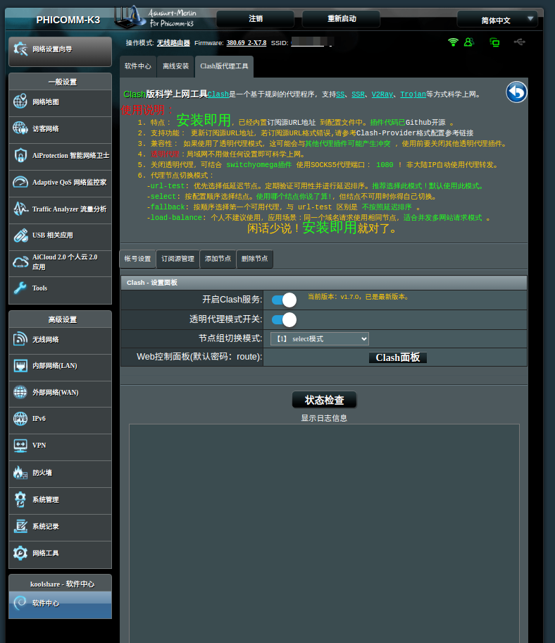

# clash项目说明
>这个项目仅用于斐讯K3路由器梅林改版380固件。

## 使用满足条件

CPU架构: Armv7l (能运行clash可执行程序)
路由器固件： 梅林380改版


## 基本功能

- [x] Clash服务启动开关
- [ ] 透明代理启用开关: 选择是否需要使用透明代理(感觉不到自己使用了代理，内网应用不做任何配置即可访问Google)
- [ ] ~~网络状态检查(似乎这个功能有点多余)~~
- [ ] 节点配置:支持provider(url)和group配置。
- [x] DNS设置：使用无污染的DNS解析国外域名。

## 怎么使用？

```bash
git clone https://github.com/learnhard-cn/clash.git
rm -tr clash/.git
tar zcvf clash.tar.gz clash
```

或者， 到`Release`页面下载安装包 [https://github.com/learnhard-cn/clash/releases/latest](https://github.com/learnhard-cn/clash/releases/latest)

选择最新版本下载到本地，重命名为： `clash.tar.gz` 。

接下来就可以将这个安装包通过SSH传输到路由器上的`/tmp/`目录上，执行如下命令进行手动安装：

```bash
cd /tmp
tar zxvf clash.tar.gz
sh clash/install.sh
```
安装成功后，即可在`软件中心`里看到`clash`插件了。


## 为什么有这个项目

由于种种原因，某些路由器的固件停留在了`梅林380改版`，但是现在很多插件开发都不再支持`梅林380改版`了，例如`Clash`没有找到一个支持版本。

因此，就产生了这个项目。

## 主界面



